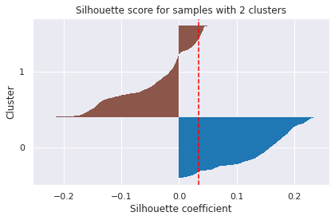

<h1>DBC on HPC dataset</h1>

Discriminately Boosted Clustering builds on DEC by using convolutional autoencoder instead of feed forward autoencoder. It uses the same training scheme, reconstruction loss and cluster assignment hardening loss as DEC. DBC achieves good results on image datasets because of its use of convolutional neural network.

<h1>Results</h1>

To visualize the clusters, I used the Principal Component Analysis (PCA), to reduce the number of features in our data set we deployed PCA (Principal Component Analysis) which tries to find the best possible subspace. 
On the left we can observe PCA with 2 components and on the right PCA with 3 components

<figure>
</img>
<figcaption>PCA - 2 components</figcaption>
</figure>
&nbsp;

&nbsp;
<figure>
</img>
<figcaption>PCA - 3 components</figcaption>
</figure>
&nbsp;

&nbsp;

 In the Silhouette plot below we can see that the data instance is close to the center of the cluster and instances possessing the silhouette scores close to 0 are on the border between two clusters. .

<figure>
</img>
<figcaption>Silhouette plot</figcaption>
</figure>

Considering the hyperparameters epochs=100, the batch size= 256 and the validation size= 64, I obtained the following results.

<ul>
<li>Accuracy = 70.37%</li>
<li>Silhouette Score = 0.409</li>
<li>NMI = 0.00194</li>
</ul>
